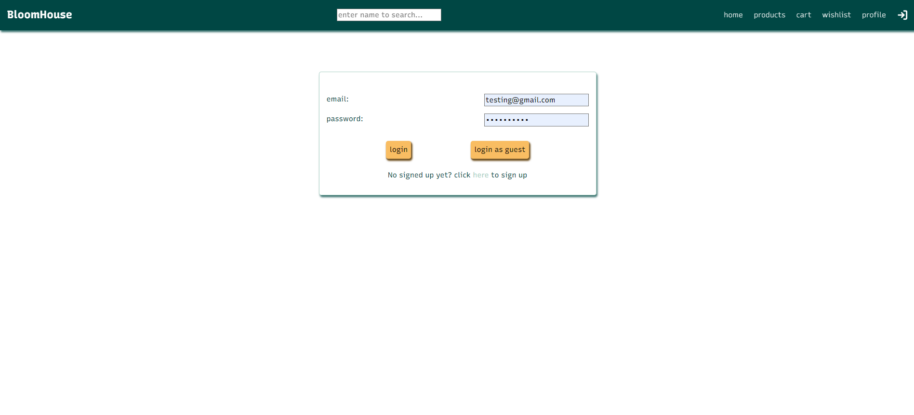
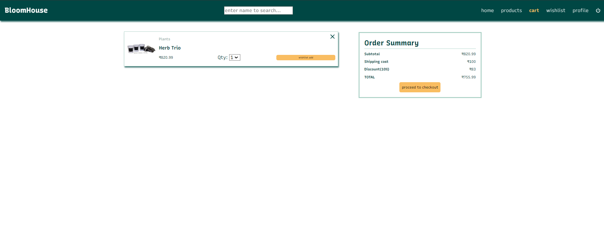
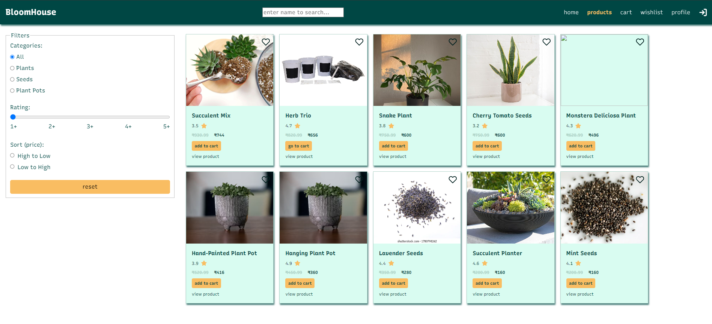
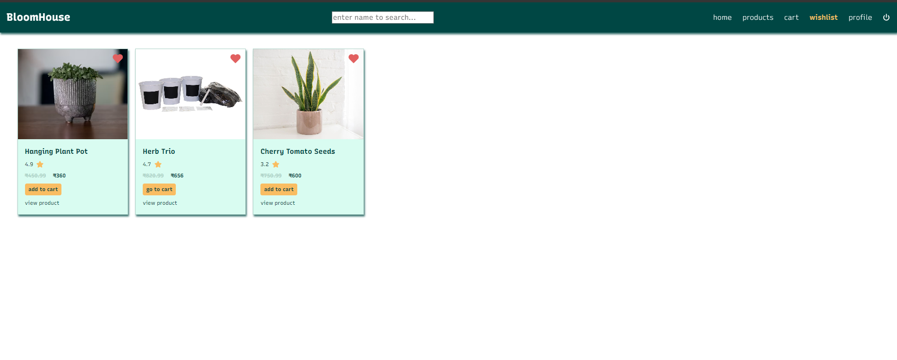
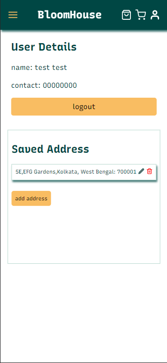
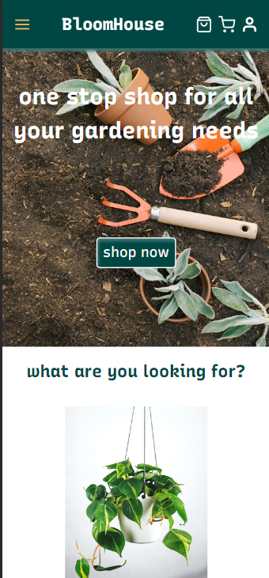
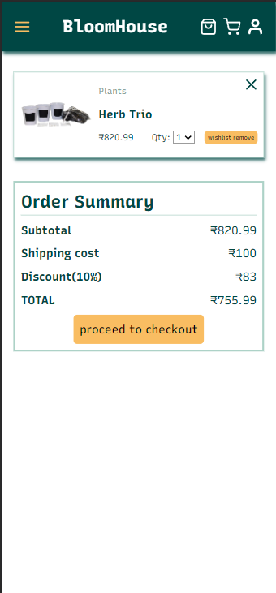
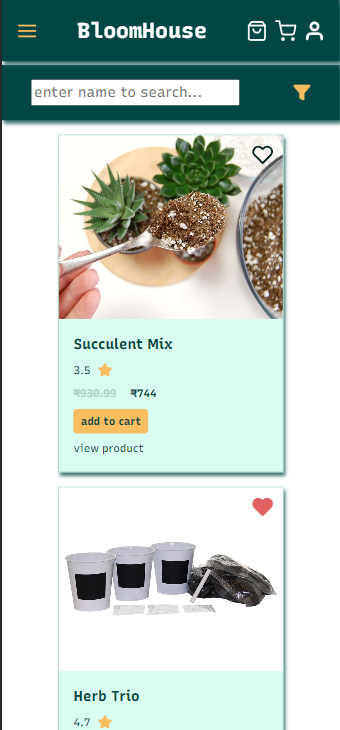

# bloom-house

An online platform to buy gardening plants and related items with responsive UI but mobile and desktop.

## Functionality:

address management, cart management, wishlist management, user authentication and authorization

## tech stack

- Frontend: react, react router
- Backend: Supabase

## Screenshots

- Desktop

  - 
  - 
  - 
  - 

- Mobile
  - 
  - 
  - 
  - 
